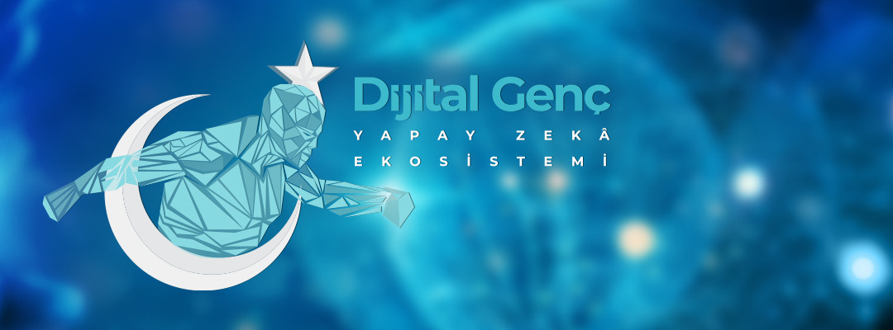

**
<h1> Dijital Genç Yapay Zekâ Ekosistemi </h1>
**

Cumhurbaşkanlığı Dijital Dönüşüm Ofisi Dijital Genç Yapay Zekâ Ekosistemi, üniversitelerdeki yapay zekâ ile ilgili öğrenci kulüplerinin tek bir çatı altında toplayarak bu alanlardaki potansiyel nitelikli iş gücünün uygulamaya dayalı eğitimler, yarışmalar ve eğitim sonrası kariyer ödülleri ile desteklenmesi hedefiyle kurulmuştur. İlgili kulüplere dahil olan yapay zekâ ile ilgilenen on binlerce öğrencimizin eğitim hayatı kamu-akademi iş birliğiyle desteklenerek, mezuniyet sonrası süreçte kaliteli bir kariyer yolu çizilmesi konusunda imkân sağlanacaktır.

Dijital Genç Yapay Zekâ Ekosistemi kapsamında düzenlenecek etkinlikleri ve güncel duyuruları aşağıdaki kanallardan takip edebilirsiniz:

* **Telegram:** https://t.me/dijitalgencyz.

* **Whatsapp:** https://whatsapp.com/channel/0029VaccbAfA2pL69lRYSM27

* **bip:** https://channels.bip.ai/join/dijitalgencyz

Dijital Genç Yapay Zekâ Ekosistemine dair sıkça sorulan sorulara [buradan](https://cbddo.gov.tr/sss/dijital-genc/) ulaşabilirsiniz.

Soru, görüş ve önerileriniz için Başkanlığımızla dijitalgenc@cbddo.gov.tr adresi üzerinden iletişime geçebilirsiniz.

## **Aylık Webinarlar**

* Webinar I - **Veri Operasyonları**
* Webinar II - **[Veri Ön İşleme](https://github.com/cbddobvyz/dijital-genc-yze/tree/main/Webinar/Webinar-II-VeriOnisleme)**
* Webinar III - **[Sağlıkta YZ Uygulamaları | Mamografi Görüntülerinden Kitle Tespiti-I](https://github.com/cbddobvyz/digitaleye-mammography)**
* Webinar IV - **[Sağlıkta YZ Uygulamaları | Mamografi Görüntülerinden Kitle Tespiti-II](https://github.com/cbddobvyz/dijital-genc-yze/tree/main/Webinar/Webinar-IV-Sa%C4%9Fl%C4%B1kta%20YZ%20Uygulamalar%C4%B1%20%7C%20Mamografi%20G%C3%B6r%C3%BCnt%C3%BClerinden%20Kitle%20Tespiti-II)**
* Webinar V - **[Ozellik Muhendisligi](https://github.com/cbddobvyz/dijital-genc-yze/tree/main/Webinar/Webinar-V-Ozellik%20Muhendisligi)**

## **Tematik Eğitimler**  

#### **[Makine Öğrenmesi](https://github.com/cbddobvyz/dijital-genc-yze/tree/main/Tematik/Makine%20Ogrenmesi)**

- **[Sınıflandırma](https://github.com/cbddobvyz/dijital-genc-yze/tree/main/Tematik/Makine%20Ogrenmesi/Siniflandirma)**
